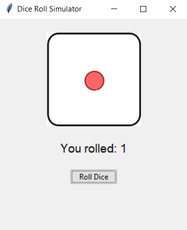
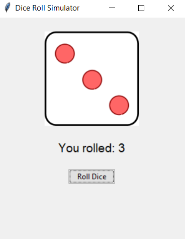

# 🎲 Dice Roll Simulator

A Python program that simulates dice rolls with ASCII art and GUI versions.




## 🌟 Features
- CLI version with ASCII art dice
- GUI version with images
- Realistic rolling animation (CLI)
- Simple graphical interface
- Multiple dice support (GUI)

## 🛠️ Requirements
- Python 3.x
- `Pillow` library (for GUI version)
- Tkinter (usually included with Python)

## 🚀 Usage
CLI Version:
```bash
python dice_cli.py
```
GUI Version:
```bash
python dice_gui.py
```

## ⚙️ Installation
```bash
git clone https://github.com/Parsa-developer/dice-roller.git
cd dice-roller
pip install -r requirements.txt